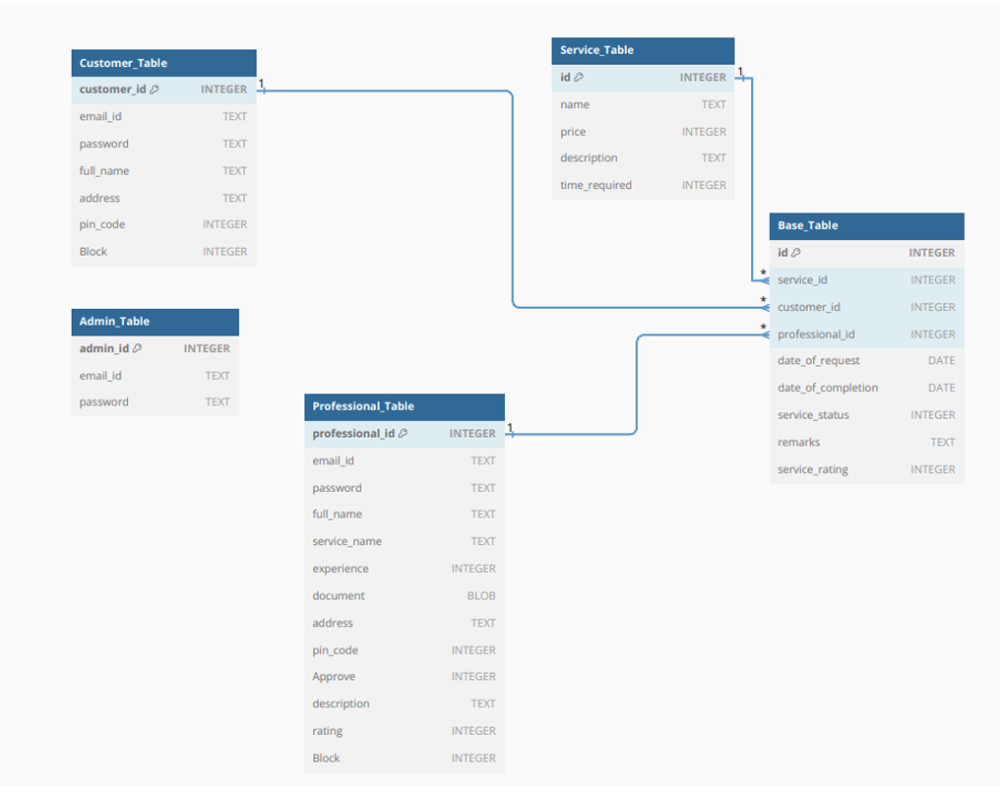

# 🏠 Household Services Web Application

Welcome to the **Household Services Web Application**! This platform connects customers with skilled professionals for household services, all managed by a powerful admin dashboard. Built with Flask, SQLAlchemy, and a modern HTML/CSS frontend, this project is your one-stop solution for seamless service management.

---

## 🚀 Quick Start

### 1. Clone the Repository
```bash
git clone https://github.com/avdisevil/Household_Services_Web_Application.git
cd Household_Services_Web_Application
```

### 2. Set Up the Environment
It is recommended to use a virtual environment:
```bash
python -m venv venv
venv\Scripts\activate  # On Windows
# or
source venv/bin/activate  # On Mac/Linux
```

### 3. Install Dependencies
```bash
pip install -r requirements.txt
```

### 4. Run the Application
```bash
python app.py
```
Visit [http://localhost:8080](http://localhost:8080) in your browser.

---

## 🛠️ Features by Role

### 👑 Admin
- **Dashboard:** View, edit, delete, and create services.
- **Service Management:** See all service requests, assign professionals, and monitor status.
- **User Management:** Approve/reject professionals, search users, block/unblock accounts.
- **Data Visualization:** Interactive charts for service stats and customer ratings.

### 🧑‍💼 Professional
- **Dashboard:** See and accept/reject new service requests.
- **Service History:** Track completed jobs, ratings, and customer details.
- **Search:** Find services by address, pincode, or completion date.
- **Profile:** Edit your professional details and upload documents.
- **Summary:** Visualize your work stats and performance.

### 🧑‍💻 Customer
- **Dashboard:** Browse and book services from approved professionals.
- **Service History:** View and close your service requests.
- **Search:** Find professionals by service, pincode, or experience.
- **Profile:** Edit your personal details.
- **Summary:** See charts of your service activity.

---

# Entity-Relationship Diagram

Below is the ER diagram representing the database structure for this project:



---

## 📦 Project Structure

```
Household_Services_Web_Application/
│
├── app.py                # Main Flask app and route registration
├── models.py             # Database models
├── api_resources.py      # RESTful API resources
├── routes.py             # All HTML view functions
├── Database/             # SQLite DB and schema
├── templates/            # HTML templates for all pages
├── static/               # (Optional) CSS, JS, images
└── requirements.txt      # Python dependencies
```

---

## 💡 Cool Extras
- **Modern UI:** Clean, responsive HTML templates.
- **Session Management:** Secure login for all roles.
- **PDF Download:** Admins can download professional documents.
- **Blocking/Approval:** Admins can block/unblock and approve users in real time.
- **Charts:** Beautiful data visualizations with Chart.js.

---

## 📝 How to Contribute
1. Fork this repo
2. Create a new branch: `git checkout -b feature/your-feature`
3. Commit your changes and push
4. Open a Pull Request!
